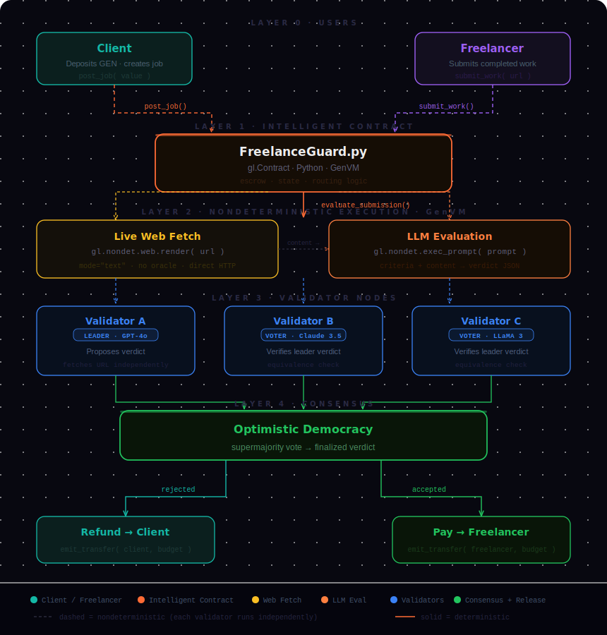

# FreelanceGuard — AI-Powered Freelance Dispute Resolution on GenLayer

> **Educational submission for:** From Zero to GenLayer — Introductory Tutorial Mission  
> **Difficulty:** Beginner → Intermediate · **Time:** ~30 min · **Platform:** GenLayer Studio (browser, no install)

---

## What is this?

**FreelanceGuard** is a complete **Intelligent Contract** built on [GenLayer](https://genlayer.com) that replaces the human moderator in freelance disputes with AI validators.

When a freelancer submits work, the contract:
1. **Fetches the submitted URL live** — no oracle required (`gl.nondet.web.render`)
2. **Evaluates the content with an LLM** against plain-English criteria (`gl.nondet.exec_prompt`)
3. **Reaches consensus** across multiple validator nodes — each using a different AI model
4. **Releases funds automatically** — to the freelancer if accepted, refunded to client if rejected

No human moderator. No platform fee. No trusted intermediary.

---

## Repository structure

```
GenLayerfreelanceguard/
├── index.html            ← Full educational site (deploy to Vercel/Netlify)
├── freelance_guard.py    ← The Intelligent Contract (paste into GenLayer Studio)
├── Architecture.svg      ← System architecture diagram
├── TUTORIAL.md           ← Full step-by-step tutorial
├── vercel.json           ← Vercel deployment config
└── README.md
```

---

## Architecture



| Layer | Component | GenLayer API |
|---|---|---|
| 0 | Client / Freelancer wallets | `gl.message.sender_account`, `gl.message.value` |
| 1 | FreelanceGuard.py (Intelligent Contract) | `gl.Contract`, `TreeMap`, `DynArray` |
| 2 | Live web fetch | `gl.nondet.web.render(url, mode="text")` |
| 2 | LLM evaluation | `gl.nondet.exec_prompt(prompt, response_format="json")` |
| 3 | Validator nodes (GPT-4, Claude, LLaMA…) | `gl.vm.run_nondet_unsafe(leader_fn, validator_fn)` |
| 4 | Optimistic Democracy consensus | Supermajority vote on equivalence |
| 5 | Automatic fund release | `emit_transfer(address, amount)` |

---

## Quick start (GenLayer Studio)

1. Go to **[studio.genlayer.com](https://studio.genlayer.com)** — no install needed
2. Create a new file: `freelance_guard.py`
3. Paste the full contract from `freelance_guard.py` in this repo
4. Click **Deploy** — no constructor args needed
5. Call `post_job()` and send GEN to create a job
6. Call `submit_work()` with a public URL
7. Call `evaluate_submission()` and watch Optimistic Democracy run
8. Call `get_job()` to read the AI verdict and check fund release

See `TUTORIAL.md` for the full annotated walkthrough.

---

## Key GenLayer concepts demonstrated

| Concept | What it does | Used in |
|---|---|---|
| `@gl.public.write.payable` | Method can receive GEN tokens | `post_job()` |
| `gl.message.value` | Amount of GEN sent with transaction | `post_job()` |
| `gl.message.sender_account` | Verified caller wallet address | `submit_work()` |
| `gl.nondet.web.render(url, mode="text")` | Fetch live URL — no oracle needed | `evaluate_submission()` |
| `gl.nondet.exec_prompt(prompt)` | Call LLM inside consensus | `evaluate_submission()` |
| `gl.vm.run_nondet_unsafe(leader_fn, validator_fn)` | Run Optimistic Democracy | `evaluate_submission()` |
| `emit_transfer(address, amount)` | Send GEN tokens to any address | `evaluate_submission()` |
| `TreeMap[K,V]` | Persistent on-chain mapping (use instead of dict) | Contract state |
| `DynArray[T]` | Persistent on-chain array (use instead of list) | Contract state |

---

## Critical rules — avoid these common mistakes

### ❌ Mistake 1: LLM/web call outside inner function

```python
# WRONG — call directly in method body
@gl.public.write
def evaluate(self, job_id: int) -> None:
    result = gl.nondet.exec_prompt("...")        # ERROR

# CORRECT — must be inside an inner function
@gl.public.write
def evaluate(self, job_id: int) -> None:
    def leader_fn():
        return gl.nondet.exec_prompt("...")
    result = gl.vm.run_nondet_unsafe(leader_fn, validator_fn)
```

### ❌ Mistake 2: Accessing self inside nondet block

```python
# WRONG — self is not accessible inside inner function
def leader_fn():
    content = gl.nondet.web.render(self.url)    # ERROR

# CORRECT — capture locals before entering the block
url = job.submission_url
def leader_fn():
    content = gl.nondet.web.render(url)         # use captured local
```

### ❌ Mistake 3: Not reassigning to TreeMap

```python
# WRONG — mutation alone does NOT persist
job = self.jobs[job_id]
job.verdict = "accepted"

# CORRECT — must reassign back to TreeMap
job = self.jobs[job_id]
job.verdict = "accepted"
self.jobs[job_id] = job     # ← this line is required
```

### ❌ Mistake 4: Using dict/list for persistent state

```python
# WRONG — dict is not persisted between transactions
class MyContract(gl.Contract):
    jobs: dict

# CORRECT — use GenLayer storage types
class MyContract(gl.Contract):
    jobs: TreeMap[int, Job]
```

---

## Resources

- [GenLayer Docs](https://docs.genlayer.com)
- [GenLayer Studio](https://studio.genlayer.com)
- [GenLayer Discord](https://discord.gg/8Jm4v89VAu)
- [GitHub — GenLayer Labs](https://github.com/genlayerlabs)

---

*Built for the GenLayer Educational Content mission — "From Zero to GenLayer: An Introductory Tutorial"*
